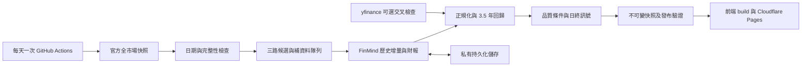

# 台股低位研究室 — 全新產品與開發計畫

版本：1.0｜2026-09-08｜狀態：規劃完成，尚未實作或驗證投資績效。

本計畫從空 repo 開始，不依賴舊站的程式、資料格式、介面或評分。`answers.key` 是本專案唯一的驗收標準檔，內容為 JSON，不是 API 金鑰。部署與資料來源證據見 `docs/SOURCES.md`。

## 1. 產品決策

建立一個每天更新一次、以「找出值得深入研究的台股」為核心的個人投資工作台。首屏回答四個問題：今天哪些公司值得看、為什麼出現、價格是否在 3.5 年低位、還缺什麼才能考慮出手。

使用者已確認：台股；每月買進／加碼最多 2 次、每年最多 24 次，賣出另計；可接受組合約 30% 回撤；喜歡低基期、有防守性與護城河的公司或低基期成長股；3.5 年線性回歸＋標準差。基準策略採現股、無槓桿，這是產品預設，不是使用者另行確認的融資限制。

年化 50% 是研究挑戰目標，不能做成產品宣傳、評分保證或軟體上線的必要條件。產品完成與策略有效分開驗收；策略不達標也必須忠實顯示結果。

### 建议方案與取捨

| 方案 | 優點 | 問題 | 決策 |
|---|---|---|---|
| 只算投信前 100 名 | 首次資料量最小 | 偏向法人熱門股，容易漏掉未被買進的低位股 | 不作唯一入口 |
| 每日重新抓全市場全部歷史 | 邏輯直接 | 重複下載、耗配額、很難穩定 | 不採用 |
| 全市場輕量快照＋多路候選＋歷史增量快取 | 兼顧涵蓋與成本，可逐步擴充 | 需明確處理首次建庫與資料覆蓋率 | 採用 |

### 資料邊界

只使用 FinMind、yfinance、TWSE、TPEx 可取得的資料。不能增加財報狗、新聞站、公司官網爬蟲、TDCC、付費券商報告、社群資料或外部 AI 推論服務。GitHub 與 Cloudflare 是程式執行、儲存及部署服務，不是新增行情來源。

第一版對「護城河」只提供財務品質代理：獲利穩定、資本報酬、現金轉換、負債與毛利率。產品文字必須寫「品質條件」，不能宣稱已證明護城河。成長催化劑限於已公布的營收、利益與毛利改善，不能自動編造客戶、訂單或新產品故事。

## 2. 核心使用流程

1. 開啟「今日研究」：先確認市場日期與更新狀態，再看最多 10 檔優先研究名單；不足 10 檔不硬湊。
2. 每張摘要顯示入選原因、3.5 年 Z 值、品質／成長檢查、主要風險、資料完整度。點選後看個股頁。
3. 個股頁同步查看五線譜、營收、營業利益與投信十日動向；每個判定能展開原始值、期間、公式與來源。
4. 選 2～4 檔比較，加入本機自選，記錄研究理由與否決原因。
5. 每月兩個檢查日審視「進場觀察」；每日篩選不等於每日交易。
6. 手動記錄交易後，網站顯示本月／本年買進次數、投入比例與日終風險。網站不串券商、不自動下單。

空名單是正常結果。畫面應說明「目前沒有同時符合價格與品質條件的標的」，並提供放寬條件後的研究名單，不偷偷改正式條件。

## 3. 功能與頁面

| 頁面 | 必備功能 | 主要操作 |
|---|---|---|
| 今日研究 `/` | 日期、資料狀態、三路候選數、今日新增／改善／移出、優先研究 10 檔 | 看原因、加入自選、開個股 |
| 選股器 `/screener` | 搜尋代碼／中文名；市場、產業、入口、Z 值、品質、成長、流動性、資料狀態篩選；欄位排序；儲存條件 | 篩選、比較、CSV 匯出 |
| 排行榜 `/rankings` | 投信淨買超股數／成交占比、營收成長、低位品質；今日排名與相較前日變動 | 1／5／10／20 交易日切換 |
| 個股 `/stocks/:code` | 最新 3.5 年五線譜、已保存的歷史當日 Z／五線數值摘要、財務與法人圖、逐條條件、風險與來源、首次入選與移出原因 | 查歷史摘要、比較、筆記 |
| 比較 `/compare` | 最多 4 檔同口徑比較、不同資料期間顯著標註 | 替換標的、保存比較 URL |
| 自選與紀律 `/journal` | 本機自選、研究筆記、交易流水、買進次數、日終部位與風險試算；JSON 匯出／匯入 | 記錄／修正／備份 |
| 策略檢驗 `/research` | 固定版本回測、每日前向追蹤、基準、交易明細、成本與資料限制 | 比較版本、匯出明細 |
| 方法與資料 `/methodology` | 公式、閾值、資料完整度、來源日期、更新紀錄、版本變更 | 展開公式與來源 |

前端篩選、搜尋與排序都讀取同次發布的靜態資料，不向金融 API 發送請求。改篩選只影響本機顯示，不改後端正式策略或歷史績效。

本機自選／交易存 IndexedDB；支援匯出備份，不假裝具有跨裝置同步。私人持股不寫入公開 JSON、Git 或分析服務。本機自選不會自動送到每日批次；批次保留的是版本化 `config/tracked_symbols.json` 與模型持股。所有已建庫股票仍每日更新價格指標，因此大部分本機自選不受候選資格變動影響；尚未建庫者明示等待覆蓋。

日誌必含初始估值日、初始現金／持倉／成本、買賣、費用、股息、入金與出金。組合回撤以資金流調整後的單位淨值計算：初始總資產定義初始單位，新增資金在指定日初按前一日單位淨值增發單位，提領反向減少；費用與股息屬投資損益，不屬外部資金流。第一版只支援日初外部資金流，匯入其他時點需使用者確認歸屬日，不能默默改時間。起始持倉用估值日市價計入NAV，成本另存供未實現損益使用。歷史原價或公司行動不足時只提供當前部位／風險試算，不計算假的個人績效。

## 4. 視覺設計

採「安靜、精準的財務研究工作台」。亮色為預設，深色可切換；資訊密度高但不做滿版霓虹、價格跑馬燈或裝飾性大圖。使用者第一眼應看到日期、名單與理由。

- 色彩：背景 `#F5F7FA`、卡片 `#FFFFFF`、主文字 `#172033`、次文字 `#526077`、主操作 `#2457D6`、邊框 `#D8DFEA`。深色用獨立語意色，逐項測對比。
- 台股慣例：上漲紅、下跌綠，均附正負號；條件通過採藍色核取，避免與漲跌混淆。資料缺漏使用文字與中性標籤，風險用琥珀色警示。
- 中文使用系統繁中字型，數字使用等寬數字；不依賴外部字型網路服務。尺寸與空間採 4／8px 節奏。
- 桌面左側導覽，內容最大寬度 1440px。表格固定代碼／名稱欄，財務數字靠右；手機改摘要卡或可控表格，不讓整頁橫向溢出。
- 首屏只放四個摘要：市場資料日、進場觀察數、低位候選數、資料完整度。報酬未驗證時不出現炫耀式報酬大字。
- 圖表的主角是價格與回歸中線，上下帶用低飽和細線；滑鼠／觸控交叉線顯示同日價格、各線價格與 Z 值。
- 所有按鈕具 hover、focus、loading、disabled；鍵盤可操作，觸控區至少 44px；一般文字對比至少 4.5:1。
- 必須有初次建庫、零結果、缺資料、部分來源延遲、整次更新失敗、合法停牌等狀態設計。

首頁草圖：

```text
台股低位研究室             搜尋代碼／公司       資料日 · 更新狀態
今日研究 / 選股 / 排行 / 自選 / 策略檢驗 / 方法

[市場資料日] [進場觀察] [低位候選] [完整度]

今天值得先研究                           [和昨天比較]
代碼 名稱 | 入選理由 | 3.5 年 Z | 品質 | 成長 | 主要風險 | 自選
...

投信關注           低位品質           成長改善
[各入口摘要；可點進完整排行榜]

今日移出與原因                         資料更新／版本資訊
```

## 5. 選股母體與資料品質

公司主檔定義母體，不由行情代碼長度推測商品。第一版含 TWSE／TPEx 普通股，排除 ETF、ETN、權證、特別股、興櫃；金融業可搜尋，但不套非金融策略，顯示 `not_applicable`。

正式候選基本限制：最近 20 市場交易日日均成交金額至少新台幣 2,000 萬元；最新有可交易報價；不在已知暫停交易狀態。門檻可配置且必須寫入策略版本。缺少足夠 20 日資料不可假裝通過。

股票識別為市場＋字串代碼＋有效期間，保留前導零；記錄上市／上櫃轉板與下市。KY 公司不直接排除，但幣別、報表與每股單位需一致。排名時只合併相同口徑的單位。

每個指標回傳 `{value, unit, period, available_at, status, source_refs, formula_version}`。`status` 只能為 `pass`、`fail`、`unknown`、`not_applicable`；缺值不得等於 0 或 fail。核心品質資料缺漏者可研究，不可進「進場觀察」。

## 6. 多路排行榜預篩

每天先抓全市場輕量批次，再由三路挑出值得補齊歷史與深入計算的股票。所有排行榜先經基本流動性限制，再依完整合資格母體排名；不能在 Top 100 內重新計算百分位冒充全市場百分位。

### A. 投信關注入口

兩市場每日報表先統一成股數，再用最近 10 個「市場交易日」的逐日投信買進／賣出資料：

```text
net_shares_10 = Σ_TWSE(buy_shares_d - sell_shares_d)
              + Σ_TPEx((buy_lots_d - sell_lots_d) × 1000)
```

先合併完整 TWSE＋TPEx 市場排行，取淨買超前 100 作共同 A 母體；投信關注 tab 再取 Top10，並和前一交易日完整 Top10 比較。`current_rank <= 10` 且 `previous_rank > 10` 或不在前一期者標為「新進榜」。前一期缺失時標 `unknown`，不能把當期全部冒充新進榜。PEG 仍顯示，但不作投信訊號的硬 gate；沒有數值 PEG 的列不硬湊數字。

完整報表未列某股時，只有來源規格確認代表零交易，才可補 0；抓取失敗、部分報表或意義不明的缺列一律 unknown。上市與上櫃都必須成功，否則不能產生冒充完整跨市場的排名。

### B. 成長改善入口

以最新公布的連續三個月合計營收年增率排序，取 Top 100；要求年增至少 15%、比較期營收正值，且目前已知近四季營業利益為正。缺財報者進補資料隊列，不當成已合格。

加列「三個月年增率相較前三個月改善幾個百分點」、近四季營業利益年增與毛利率變化。這些是營運改善證據，不稱未來成長預測。

### C. 低位品質入口

從最近一次通過品質門檻的公司，取 3.5 年斜率正、`Z <= -1` 的 Top 100（Z 由低到高）；未被投信買超也能出現。首次建库尚无 3.5 年價格時，以同產業正本益比便宜程度作「待建庫候選」，不得冒充已通過五線譜。

### 合併、保留與補資料

- 三路聯集最多約 400 檔，去重並保留所有入選原因，不強制每天達到固定數量。
- 模型持股、`tracked_symbols`、過去 60 交易日曾有進場觀察訊號的股票另外保留；退出排行不是賣出訊號。
- 每日新建深度資料最多 20 檔，三路 round-robin 分配；不足名額按其餘隊列補上。已追蹤缺關鍵資料的股票優先，避免爆量新名單拖垮更新。
- 每日再安排最多 10 檔非候選公司輪巡補庫，順序為最久未覆蓋、代碼排序；受相同 API 預算限制。此措施減少入口選擇造成的永久盲區。
- 所有已建庫股票的價格／回歸每日更新；深度財報只在新期間、內容更正或覆蓋不足時重抓。回歸本身不是主要成本。
- 顯示母體家數、已建庫家數、三路候選家數、待補家數、財報完整家數。不可把部分覆蓋稱成「掃描全市場全部條件」。

## 7. 3.5 年五線譜規格

### 唯一基準公式 `lohas-linear-3.5y-research-v1`

對市場日期 `t`，使用 `[t 減 1,278 個日曆日, t]` 固定 3.5 年框架內的有效日調整後收盤價，按日期排序。資料截止不得超過 t；合併舊資料也必須先裁回此框架。

```text
x_i = 0, 1, ..., n-1                     # 有效交易觀察索引
y_i = 調整後收盤價                        # 固定為線性價格，非 log
b = Σ((x_i-x̄)(y_i-ȳ)) / Σ((x_i-x̄)^2)
a = ȳ - b*x̄
e_i = y_i - (a + b*x_i)
sigma = sqrt(Σ(e_i^2) / n)               # 殘差母體標準差，ddof=0
mid_t = a + b*(n-1)
bands_t = mid_t + k*sigma, k∈{-2,-1,0,1,2}
z_t = (y_last - mid_t) / sigma
```

至少已有完整 3.5 年掛牌歷史，區間內有效價格覆盖率達當時市場交易日的 95%；合法停牌也列入覆蓋說明，不補成成交日。低於標準時 `insufficient_history`，仍能看行情，但不能標示正式 3.5 年訊號。

當 `sigma <= 1e-10 * max(1, abs(mean(y)))`，Z 為 null、原因 `zero_residual_variance`。完美直線不能輸出無限大 Z。R²可作擬合描述，但不能當成勝率或未來正確率。

圖表明確分兩種：

1. 「本期 3.5 年回歸」：固定框架內歷史價格配上觀察日 t 算出的五條直線，用於檢視當下模型。
2. 「歷史當日位階」：每個歷史日用當日以前 3.5 年資料算出的 Z；歷史買點只能根據此序列產生。

不能用今天的回歸線回頭判斷以前的買點。第一版只提供最新完整 3.5 年價格／回歸圖，歷史日期選擇查閱當時已保存的 Z、五線末端數值、規則與訊號摘要；不提供未發布的舊日完整 3.5 年曲線，也不讓前端讀私有 R2。歷史摘要讀不到時明示未保存，不以最新回歸回填。

為判定最近八週曾處低位，bootstrap 最少取得「固定 3.5 年框架＋120 個日曆日」價格，逐日再用各自 3.5 年窗口計算最近八個完整週需要的歷史 Z。只有 3.5 年價格時可顯示當前線，但八週條件仍 unknown。第一版的歷史 Z 圖只顯示確實可計算／已保存的區間；若未來要看完整歷史 Z，須另取得更長價格序列，不偷偷延伸現有序列。

### 公司行動與價格

保留未調整 OHLCV、股利／分割／減資事件及調整係數。一般現金股利與純分割可由確認事件推導，複合減資／配股需通過來源對照 fixture；不能確認時該期間 `adjustment_unverified`，不產生買進訊號。FinMind 付費還原價可作可選替代，但免費版必須有明確缺資料狀態。

事件更正後，只重建受影響股票與資料版本；舊訊號快照不覆寫。跨來源切換前核對幣別、日期、還原基準與收盤價；差異超過 0.5% 或一個合法跳動單位的較大值時先隔離，不能直接拼接兩條不同基準的還原價。

指標使用調整價；交易與現金帳使用原價及公司行動。不得同時計入 adjusted-return 與額外股息而雙算報酬。

## 8. 品質、成長與訊號

### 品質必要條件

- 最近三個完整年度歸屬母公司淨利皆正。
- 最近三個完整年度營業現金流皆正。
- 三年 ROE 中位數至少 12%；年度 ROE 使用該年度歸屬母公司淨利／期初期末平均歸屬母公司權益。任一必要權益分母非正時 unknown，不以高比率放行。
- 淨現金，或淨負債／近四季 EBITDA <2 且 EBITDA >0。淨負債為已確認有息負債（含租賃負債）減現金及約當現金；EBITDA 為營業利益加折舊攤銷。缺項不能當 0；淨現金已可確認時，該替代路徑不強迫要求 EBITDA。

合併、個別、年度、單季與累計報表不得混算。輸入累計數需先還原單季，Q4 = 全年減前三季累計；只在完整期間可用時才組 TTM。毛利率、EPS、幣別與股數均保留原始口徑。

### 兩個研究分組

| 分組 | 條件 | 用途 |
|---|---|---|
| 品質成長（主策略） | 品質通過、三月合計營收年增 ≥15%、TTM 營業利益年增 ≥15%，前期營業利益正 | 尋找獲利成長與價格修復重疊 |
| 防守價值（研究分組） | 品質通過、三月合計營收年增 ≥0、TTM 營業利益年增 ≥0，價格低位 | 保留偏好的防守股票，績效另列 |

虧轉盈顯示「轉盈」而非無限大的成長率；第一版不自動納入上述成長率硬門檻。不同分組不混成同一勝率或同一組回測。

### 狀態機

`待補資料 → 值得研究 → 低位觀察 → 進場觀察`；任何階段可轉 `條件失效` 或 `資料不足`。

進場觀察（研究訊號，不是下單）須：品質與對應分組通過、3.5 年斜率正、最近八個已結束交易週曾 `Z<=-1`、目前 `Z<=0`，最新已結束交易週收盤高於十週均線。財務資訊必須在觀察時已可得，价格最新且公司行動已驗證。

止跌確認採完整週資料；週一至四不把未結束的本週收盤當週線。交易週最後實際交易日以官方日曆判定，含週五休市的情形。

五線譜中線不是合理價。第一版無外部預測，因此不自動捏造「合理價」與 3 倍報酬風險比。介面可讓使用者在本機輸入估值假設與停損，自行試算並標「使用者情境」；不影響官方訊號或回測。這是對前次投資構想在資料約束下的明確收斂。

### 排序

第一版避免難以解釋的 0～100 總分。按狀態優先、核心資料完整、品質通過數、營收成長、投信成交占比、代碼依序排序；只在相同可比狀態內排序。缺欄位不能因重新配權反而提高排名。每一列展示實際理由，不產生勝率數字。

## 9. 交易紀律與風險呈現

正式模型參數版本 `quality-growth-v1`：每月檢查日 12／26 日（休市順延），每個窗口最多一次買進或加碼，每月最多二次、每年最多二十四次，不用滿額。窗口由單一決策截止日產生，若兩個窗口順延撞同日也不重複使用同一訊號。

六個持股名額，首次部位 7.5%、單次加碼至最多 12.5%、股票合計最多 75%、同產業最多 30%。每檔最多加碼一次，成本報酬達 +8%、品質仍通過才允許。單檔計畫損失最多組合 1.5%，由部位與停損距離計算；無足夠資料時不提出加碼。

回測初始停損採成本下方 12%，加碼後按加權成本計算且檢查風險預算。正式模型固定為「當日未調整收盤價經已確認公司行動對齊成本後，收盤報酬 <= -12% 才觸發，下一可交易日開盤退出」；日內低點穿越後收回不觸發。這與一天一更的產品能力一致，不模擬網站沒有代掛的盤中停損。首次日終 Z≥+2 可減半一次；其餘部位連續兩個完整週收盤低於十週均線退出。資料可證的品質失效於下一可交易日退出；六個月未達 +8% 且最近三月營收成長未高於進場值時時間退出。此數值版時間退出取代不能從四來源客觀取得的「新產品催化劑有沒有實現」。

風險順序：硬停損／無法維持風險預算、組合減碼、品質失效、週線退出、時間退出、部分獲利、最後才買進。相同日對同股只產生一個合併執行決策。停損價僅是觸發點；跳空、無成交與跌停可能無法在該價成交。

組合採持久化狀態 `normal / paused / defensive / crisis`，上限依序為75%／75%／50%／25%；除normal外均不新增部位。日終高點回撤達15%／20%／25%依序升級，直接跳到對應較嚴重狀態；較小反彈不自動解除。減碼由條件失效、較低優先級與較高風險部位開始。

恢復normal須同時满足：回撤已低於10%、最近20個市場交易日未創本次風險事件的NAV新低、至少一檔候選通過品質。只在下一買進窗口恢復，仍按單次部位與二次／月逐步增加。每個run先判斷風險升級，再判斷恢復；不能仍在25%回撤時因短期未創低就加碼，又被同一門檻強迫賣掉。狀態、事件低點與最後新低日期皆保存。此保守恢復規則的現金拖累須在回測評估；30%仍只是容忍目標，不是保證上限。

網站一天一更只能顯示日終狀態，不提供盤中停損監控。實際交易使用者自行處理，日誌的風控提醒不冒充即時券商條件單。股票拆分、股息、日誌修正都不算出手；同一決策的分批成交用 decision_id 合併，同日不同決策分開計數。

## 10. 每日資料流程



預設每天台北 23:17 啟動（UTC cron `17 15 * * *`），包含週末；市場沒有新交易日時不製造新行情，可更新已公布財報、補庫與檢查來源。資料／程式內容完全沒變不重新部署。金融源更新時間以實際資料日期判定，不把排程時間當新鮮保證。

每次先抓公司主檔、完整交易日曆、兩市場價量與投信、估值／營收批次；從持久化資料補最近缺少的交易日，保留最近 20 日法人與流動性窗口。最新 OpenAPI 不假裝支援歷史參數；歷史查詢必須使用已核對的端點或 FinMind 按股日期查詢。

財報與營收是 event-driven refresh：新期別、內容 checksum 改變、尚未完成覆蓋才重抓。未知更正可用輪巡確認；每次下載保留新版本，原版本不被覆蓋。

API 預算預設每 run 最多 300 次 FinMind 請求（含重試），且不得超過帳號剩餘額度的 80%；兩者取小。每來源 concurrency 2、依來源規範限速、30 秒 timeout、最多三次嘗試，遵守 Retry-After。遇 402 配額或 429 限流停止該來源重補工作，保留隊列，不迴避限制。

首次建庫不是每日穩態成本。優先建立三路候選，再逐步覆蓋其餘母體；免費方案可能需多次 run。提供 `bootstrap` 與 `backfill` CLI，但不另設每天第二個排程。任何完成日期由實測請求數、速度與覆蓋率報告，不能承諾一晚完成全市場。

## 11. 資料契約、版本與發布

核心資料實體：`security_master`、`trading_calendar`、`daily_quote`、`institutional_daily`、`monthly_revenue`、`financial_fact`、`corporate_action`、`indicator_daily`、`screening_snapshot`、`run_manifest`。

財務資料必帶 `period_end`、`published_at`（可能 null）、`first_seen_at`、`available_at`、`availability_basis`、報表口徑、幣別、原始單位與版本。公告時間可信才用 published_at；歷史舊資料没有時，不以 period_end 冒充公告日。

正式前向運作可採 first_seen_at 作保守可用時間。歷史研究可採明示的保守延遲近似，但必須標 `approximate_availability`，不能通過嚴格歷史績效認證。FinMind 月營收日期與財報季底日期都不是天然的公告日。

所有輸出有 `schema_version`、`strategy_version`、`formula_version`、`run_id`、`market_date`、`generated_at`、`source_refs`、`input_hash`。每日訊號不可變；同日更正新增 revision，預設 UI 顯示最新修正版，研究可鎖原版。排名母體與候選理由也要保存，不能只存最後前十名。

發布資料分片：

```text
public/data/latest.json                       # 指向此發布的 run_id
public/data/releases/<run_id>/manifest.json
public/data/releases/<run_id>/universe.json   # 全市場輕量檢索
public/data/releases/<run_id>/screening.json
public/data/releases/<run_id>/rankings.json
public/data/releases/<run_id>/stocks/<id>.json
public/data/history/YYYY-MM.json              # 月份分片的訊號摘要
```

最新個股頁按需下載，不把全部 3.5 年價格塞入首页。只發布最近一次完整版，歷史月份保存摘要與研究需要的版本；長期原始資料與回測資料留私有儲存，避免超過 Pages 檔案限制。已發布舊網址的保留策略需寫入 manifest。

單次 run：寫新 staging 路徑 → 驗證 → 保存不可變資料物件 → 最後寫完整 manifest → build/測試 → Pages 新 deployment → smoke 成功 → 記錄 published_run_id。資料最新可用版本和網站目前發布版本分開；部署失敗可用同一 validated run 重試，不重新下載或覆寫歷史。

整個站的關鍵資料維持同一 run_id，不可用今日排名配昨天價格卻不標示。兩市場行情／法人／交易日曆失敗或核心快照不完整時保留上一成功發布；FinMind 個股缺漏可發布降級結果，但相關股票不能進場。yfinance 可選檢查失敗不阻擋官方完整資料。

manifest 帶 `next_expected_update_at` 與預期交易日；前端用目前時間超過預期更新時間兩小時判斷逾期，避免排程根本沒跑時仍顯示綠燈。週末／假期需考量市場日，不單以最後行情距今幾天報錯。

## 12. 免費部署方案

### 首選：Cloudflare Pages＋GitHub Actions

- 前端：React＋TypeScript＋Vite，靜態輸出 `dist/`；表格用 TanStack Table，圖表用按需載入的 ECharts；狀態盡量用 URL、React 與 IndexedDB，不加入大型全域狀態系統。
- 批次：Python 3.12、pandas／NumPy、PyArrow、httpx、Pydantic、pytest；版本於實作啟動時鎖定並提交 lockfile。
- 排程／CI：GitHub Actions 標準 Linux runner。CI 用錄製且去識別的 fixtures，不在每個 PR 抓完整金融資料。
- 發布：Pages Direct Upload，Actions 完成計算與 build 後用鎖定版本的 Wrangler 部署。程式碼仍放 GitHub；不是要求在 Pages 機器上跑 Python cron。
- 日常资料状态：建議私有 Cloudflare R2 Standard，存分割的 Parquet 與原始回應；只作儲存。預期小型個人使用可在免費額度內，但不承諾永遠零費。
- 如果不想啟用 R2：原型可用私有 Git 資料 repo 保存分日增量與小型索引，單檔 <20 MiB、總量接近 500 MiB 時先遷移儲存。不要每天 commit 整個 SQLite／3.5 年大檔，也不把 Actions cache／短期 artifact 當唯一資料庫。正式長期版仍建議物件儲存。

R2 保留去重後公司事件與財務版本、日價與法人增量；原始完整 payload 保留 90 日，必要研究證據在到期前轉存不可變研究資料包，不因一般生命周期刪掉。`latest-state.json` 只在所有引用物件驗證後更新；恢復時驗 hash，缺檔則回退前版。避免每天複製全庫造成 N 倍成長。

GitHub secrets 只記名稱：`FINMIND_TOKEN`（免費登入 token）、`CLOUDFLARE_API_TOKEN`、`CLOUDFLARE_ACCOUNT_ID`，使用 R2 時另有 `R2_ACCESS_KEY_ID`、`R2_SECRET_ACCESS_KEY` 與 bucket 設定。任何值都不進 `answers.key`、前端、公開日誌或 Git。

### 免費選項比較（2026-09-08 查核）

| 方案 | 適合程度 | 說明 |
|---|---|---|
| Cloudflare Pages＋Actions | 首選 | 免費 Pages 足以放靜態選股站；數據在 Actions 算好，部署清楚 |
| GitHub Pages＋Actions | 可替代 | 公開 repo 可用 GitHub Free；須處理 repo 子路徑與路由。私人資料與原始金融快取不能一起公開 |
| Netlify Free | 目前不優先 | 新點數制免費每月 300 credits，正式部署每次 15；每日 30 次即 450，尚未算流量，不適合此節奏 |
| 常駐 VPS／本機排程 | 不列預設 | 免費額度或家用設備的在線、維護與恢復需自行負責，沒有本案必要性 |

GitHub Free 私有 repo 目前每月包含 2,000 Actions 分鐘；公開 repo 標準 runner 有免費使用，但不能為省分鐘而公開不適合散布的資料。估算穩態 25 分鐘×31日=775 分鐘，另保留 CI、重試、初次建庫；這是預算目標，必須實測，且額度由帳號共用。

Pages Free 的官方 build 額度為每月 500 次、單檔最大 25 MiB、檔案最多 20,000；本方案預先在 Actions build，不把該 build 次數宣稱為 Direct Upload 每月部署限額。自訂網域註冊不包含在免費託管內，可先用 pages.dev。

R2 Standard 免費額度目前含 10 GB-month、100 萬 Class A、1,000 萬 Class B／月；超額可能收費。內部預算以儲存 5 GB、每月 1 萬次寫入為預警值，記錄用量與成本，不自動升級付費資料方案。

### 部署細節

新 Pages 專案選 Direct Upload 前先確認模式；官方有 Git integration／Direct Upload 類型切換限制，不能事後假設隨意互換。Git integration 專案另有停用自動 build、再用 Wrangler 的官方路徑，但本新專案不需要雙路發布。

`daily.yml` 僅一個每日 schedule＋workflow_dispatch，使用 `concurrency` 防重疊且不取消正在寫狀態的 run。排程可能延遲／漏跑；下次根據資料水位補日，支援手動重跑；公開 repo 長期無活動也可能停用排程。前端以過期狀態顯示，不承諾準時 SLA。

`ci.yml` 跑 PR 驗證，不對未信任 PR 暴露秘密。`deploy.yml` 在 main 程式更新時用最新已驗證資料發布，不觸發第二次每日抓取；禁止 data 更新造成自我觸發部署迴圈。讀取同一 pending/validated run 的重試必須冪等。

Cloudflare 支援 SPA 路由時檢驗深連結刷新；GitHub Pages 替代模式採 hash routing 或預生成路由與正確 base，不能用首頁成功冒充所有個股頁可刷新。

## 13. 資料公開範圍

取得 API 資料的資格與對外再散布權不同。來源 registry 記錄每個可發布欄位的原始提供者、授權頁與允許用途。預設公開網站只輸出可確認可公開的官方來源或經核准衍生資料；原始資料庫不發布。

yfinance 第一版只作私有核對，缺少公開使用依據時不把 Yahoo 價格序列或其衍生圖表包進公開站。FinMind 的 API 會員資格也不能直接視為對外散布許可。若某核心圖表尚未滿足發布條件，公開版顯示資料不可用及原因，私人研究資料仍留私有儲存；不能把「網址沒有宣傳」當成私人部署。

這些檢查是實際公開部署驗收項，不阻擋先完成產品與離線功能。不能為了資料缺口增加第五個行情來源。

## 14. 策略有效性驗證

### 三層完成定義

1. 軟體正確：公式、資料期間、排名與計數有客觀 fixture，網站與發布流程完整可用。
2. 研究可信：來源時間、下市樣本、公司行動、成本與成交限制齊備；近似資料明确標註。
3. 投資有效：鎖定策略在樣本外表現與風險達到研究目標。未達到不能靠改文案通過。

建立三組消融實驗：只投信入口、三入口但無轉強條件、完整三入口＋品質＋低位＋轉強＋風控。另比較不預篩的全市場完整資料基準，衡量預篩漏失了多少合格股票與報酬機會。若全市場深度資料不足，先報覆蓋與漏失評估未完成，不出假召回率。

回測固定期間建議：2014～2019 開發、2020～2022 驗證、2023～2025 保留測試；2010 起提供 3.5 年暖身。只有資料足夠才使用這個期間；財務三年門檻所需更早資料不足時排除並報覆蓋。最後測試段啟用前鎖定公式／參數，讀過結果後修改就視為用過，另做前向驗證。

嚴格回測只用當時可得財報、當時母體、當時調整事件與候選排名。無公告版本的資料做近似探索，不以當日法定申報截止日取代真實可得性的證明。2026 上线起保存 first_seen 与版本，建立真正可稽核的前向紀錄。

訊號在收盤後成立，下一可成交交易日執行。收盤停損訊號後若開盤跳空，按實際開盤及滑價；不能成交在前日設定的停損價。停牌與無法成交不虛構成交；漲跌停缺逐筆／委託資訊時採保守不成交規則。買價超出 Z≤0 或風險條件則放棄，不能回填成前日好價格。

初始成本假設：雙邊各 0.1425% 手續費、一般股票賣出稅 0.3%、每邊 0.1% 滑價，皆可配置；另跑雙倍滑價壓力測試。券商折扣、最低手續費與個人股利稅另列。股票股利與現金股利只入帳一次。

報告整體資金（含現金）CAGR、每年報酬、MDD、回本時間、最差年、持股／產業集中、買進次數、周轉、基準超額、成本、缺資料率與交易明細。標的平均漲幅不能冒充組合績效；CAGR 由期初期末 NAV 與實際天數計算，不把短期漲幅乘成年化。

目標 50% CAGR／MDD不超過30% 以 `achieved`／`not_achieved`／`not_evaluable` 呈現，不影響軟體完成判斷。模擬追蹤 3～6 個月驗證執行與資料穩定，不足以證明長期年化目標。

## 15. 全新 repo 結構與責任

以下為未來要建立的檔案，不是現有實作：

```text
README.md / PLAN.md / answers.key
package.json / package-lock.json / vite.config.ts / tsconfig.json
pyproject.toml / uv.lock
config/
  strategy.json                 # 固定閾值與版本
  source_registry.json          # 四來源、能力、單位、公開用途
  tracked_symbols.json          # 批次優先追蹤；不含私人持股數量
schemas/
  run.schema.json
  stock.schema.json
  screening.schema.json
pipeline/
  cli.py / settings.py
  sources/{twse,tpex,finmind,yahoo_check}.py
  normalize/{quotes,institutions,financials,actions}.py
  storage/{local,r2,manifests}.py
  universe.py / calendar.py / candidates.py / refresh_queue.py
  indicators/{lohas,weekly}.py
  rules/{quality,growth,states}.py
  publish.py / quality_checks.py
research/
  engine.py / execution.py / portfolio.py / metrics.py / experiments.py
src/
  app.tsx / routes.tsx
  styles/{tokens,global}.css
  data/{client,schemas}.ts
  features/{today,screener,rankings,stock,compare,journal,research,methodology}/
  components/{DataStatus,MetricCell,RuleResult,EmptyState}.tsx
  storage/journal.ts
tests/
  fixtures/{sources,formula,ranking,financials,actions,execution}/
  unit/ / integration/ / e2e/
scripts/{verify_acceptance,export_site}.py
docs/{SOURCES,OPERATIONS,DATA_CONTRACTS,RESEARCH_PROTOCOL}.md
.github/workflows/{ci,daily,deploy}.yml
```

模組只負責一件事；來源 adapter 不計算策略，策略不直接讀網路，前端不重新算正式回歸或正式排名。模組接受不可變輸入並回傳新結果；更新持久化由 storage 層原子處理。

## 16. 分階段實作計畫

採測試先行。每個階段先建立下列明確 fixture 與失敗測試，再實作對應模組，通過後做 code review；不靠網路 live 資料作唯一答案。下列命令是未來專案的執行契約，實作時須建立對應腳本，不是目前已可執行的工具。

### P0 — 資料能力與專案契約（估 1～2 工作日）

建立設定、schemas、來源 registry、鎖版環境與 README。逐個來源確認權限、schema、單位、日期、公開用途；從兩市場各取一般公司、KY、缺資料與停牌代表樣本，錄製小型 fixtures。對不存在或受限端點記 `unsupported`，不發明參數。

- [ ] 先測 schema：unknown、幣別、available_at、來源缺漏都會被正確接受或拒绝。
- [ ] 建立三種操作模式：離線 fixtures、免費資料帳號、可選付費還原價；免費模式不要求付費 endpoint。
- [ ] 固定 `answers.key` 與策略版本，確認禁止來源清單。
- [ ] 驗證命令：`uv run pytest tests/unit/test_contracts.py tests/unit/test_source_capabilities.py -q`。
- [ ] 出口：DATA-01～DATA-08；可具體說明哪些欄位可用、不可用與後備方法。

### P1 — 每日快照、快取與恢復（估 2～3 工作日）

建立 source adapters、calendar、storage、manifests、refresh queue、CLI。先提供 local storage 便於開發，再以同一契約加入私有 R2。建立兩市場同日價量／法人快照及資料水位。

- [ ] 測試 HTTP200 HTML、402、429、空回應、錯單位、昨天資料冒充今天、部分市場失敗。
- [ ] 測試週末、颱風休市、缺兩個交易日、同日重跑及更正 revision。
- [ ] 測試程序在寫檔中途被中斷後舊版本仍可讀，manifest不指向不完整資料。
- [ ] CLI 契約：`uv run python -m pipeline.cli daily --as-of YYYY-MM-DD --storage local`；日期為測試輸入，不代表最新 API 可回歷史。
- [ ] 驗證：`uv run pytest tests/unit/test_calendar.py tests/integration/test_daily_pipeline.py tests/integration/test_recovery.py -q`。
- [ ] 出口：OPS-01～OPS-07；兩市場端到端成功或清楚拒絕，沒有假成功。

### P2 — 排行榜、3.5 年回歸與選股（估 3～4 工作日）

建立 candidates、lohas、weekly、quality、growth、states。以 `answers.key` golden fixtures 固定 OLS、十交易日淨買超、累計轉單季與進場條件。

- [ ] 測試十個市場日而非十筆買超；淨買超成交占比分母；同名次排序；缺一期 unknown。
- [ ] 測試日曆 3.5 年／閏年、殘差母體標準差、零波動、公司分割與舊快照不可重畫。
- [ ] 測試未投信買超的低位品質股也能入選；落榜持股仍保留；重跑輸出固定。
- [ ] 比較暖快取与冷快取的請求量，不以理論百分比當實測節省。
- [ ] 驗證：`uv run pytest tests/unit/test_rankings.py tests/unit/test_lohas.py tests/unit/test_financials.py tests/unit/test_rules.py -q`。
- [ ] 出口：RANK-01～RANK-08、LOHAS-01～LOHAS-08、RULE-01～RULE-06。

### P3 — 網站完整研究流程（估 4～6 工作日）

從空白 React／Vite 專案建立設計 tokens、路由、所有八頁與靜態資料讀取。先用明示合成資料覆蓋狀態，接上真實輸出後不能混入示範股票或示範績效。

- [ ] 驗證搜尋／組合篩選／URL還原／排序／CSV正確，篩選缺值不會被當0。
- [ ] 個股圖預先算好，懶載入 ECharts；圖與表顯示相同數值及資料日。
- [ ] 加入本機自選、比較、交易紀錄、備份匯入及錯誤處理；不把靜態站按鈕做成假的雲端同步。
- [ ] 完成360／768／1440px版面、亮／暗色、鍵盤、讀屏摘要與各種空／錯誤狀態。
- [ ] 驗證：`npm run typecheck`、`npm run test:unit`、`npm run build`、`npm run test:e2e`。
- [ ] 出口：UI-01～UI-10、DISC-01～DISC-05；使用者從首頁到研究、比較、記錄完整跑通。

### P4 — 每日部署與營運（估 1～2 工作日）

建立 CI、daily、deploy workflow、Pages設定與操作手冊。手冊涵蓋排程停用、資料晚到、配額不足、秘密輪替、恢復與回滾。

- [ ] staging 驗證成功才替換 production；同一 run 重部署不再呼叫金融 API。
- [ ] 刻意中斷資料 run／build／deploy，各情境均保留上次可用網站。
- [ ] 以乾淨瀏覽器檢查個股深連結、静態資料、快取更新與失敗過期標籤。
- [ ] 記錄7次每日 run的時間、API 次數、下載量、快取命中、儲存量；不以預估冒充結果。
- [ ] 驗證：`uv run pytest tests/integration/test_publication.py -q`，另執行受控 preview／production smoke。
- [ ] 出口：DEPLOY-01～DEPLOY-07、PERF-01～PERF-03；正式發布 gate 通過。

### P5 — 績效研究與前向追蹤（估 3～5 工作日，歷史資料補齊另計）

建立 execution、portfolio、metrics、experiments與研究頁完整結果。輸入資料不足時仍需產出 not_evaluable 與缺口清單，不能空白頁或預填績效。

- [ ] 先用已知 NAV、成本、跳空／停牌／股息 fixture 驗證回測機制。
- [ ] 實作母體／財報可得時間／公司行動與入場窗口，逐筆交易可重算。
- [ ] 比較三組消融及全市場基準，完整記錄參數嘗試次數；禁止挑最好結果省略其他版本。
- [ ] 用時間隔離測試與每日前向紀錄評估，研究目標獨立判定。
- [ ] 驗證：`uv run pytest tests/unit/test_execution.py tests/unit/test_metrics.py tests/integration/test_research_protocol.py -q`。
- [ ] 出口：RESEARCH-01～RESEARCH-08。

估計完整 v1 約14～22工作日，前提是單一熟悉全端與Python的開發者、來源能力可取得；免費配額、歷史公告缺口与前向觀察时间不含在程式工时内。這不是交付承諾。每日選股與網站可在P4先上線，研究頁當時明確標驗證中；完整v1需P5的研究功能也通過。

## 17. 上線門檻與交接

`answers.key` 所有項目初始為 `not_run`。每個項目必有測試輸出、fixture、截圖、manifest 或發布記錄才能標 pass；檔案存在不等於功能完成。

每日網站上線階段，來源正規化、公式、規則與發布核心模組branch coverage至少80%；完整v1階段再加入交易與研究核心模組，同樣至少80%。各階段critical E2E全部通過。只為鏡射實作或湊覆蓋率的測試不算證據。

完整v1驗收必須同時通過資料、計算、UI、紀律、部署、效能與研究功能項。投資績效目標若未達成，研究結果可以通過誠實呈現的軟體驗收，但不能取得策略有效性結論。

開發者第一個任務是P0，不是先做漂亮首頁或直接搬舊站。每一階段完工都附當前覆蓋率、已知資料缺口與`answers.key`狀態，再進下一階段。
